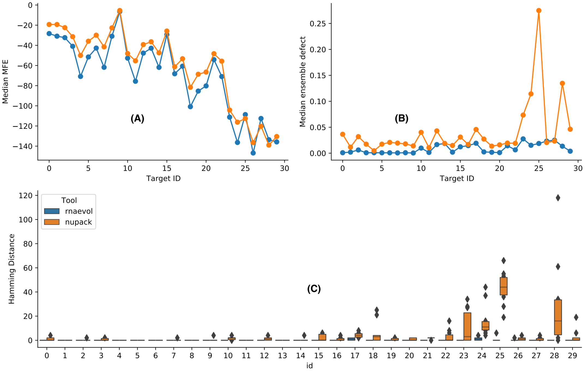

# aRNAque (simple but efficient): A simple evolutionary program for and efficient RNA design.
(@Author: [Nono Saha Cyrille Merleau](#) and [Matteo Smerlak](#) )

For a given target structure in a dot-bracket representation, the tool allows to generate good quality (low ED and MFE) RNA sequences with the corresponding strucure close to the input target.

***Figure 1:** NUPACK vs. aRNAque on RFAM benchmark dataset (Ensemble defect comparison)*

The repo is organised as follows: 
- [data](data/): The clean data used to produce the different plots presented in our paper.  The cleaned data are obtained by cleaning up the data generated from out file. for more details please refer to the python notebook [here](notebook/clean_data.ipynb)
- [docs] (docs): The files describing the evolutionary algorithm implemented.
- [images](images/): The plots (in pdf) used in the paper and the Python notebook code is in: [notebook/plots.ipynb](notebook/plots.ipynb).
- [src](src/): The source codes organized in three main parts:
      
    - [utility.py](src/utility.py): set of basic python functions usefull for our EA implementation.

    - [Landscape.py](src/Landscape.py): python class containing the information about the landscape to optimise.
    
    - [aRNAque.py](src/aRNAque.py): it contains the EA implementation, the initialization, mutation, selection and EA functions. 

# Requirements
The following softwares are required:

- Python version 2.7 or higher
- Numpy
- Pandas
- Scipy
- multiprocess
- pp
- [ViennaRNA package](https://anaconda.org/bioconda/viennarna)
- python wrapper RNA (normally included in [ViennaRNA package](https://anaconda.org/bioconda/viennarna))

To install all the requirements automatically via minicondo, simply type the following command:,

      pip -r requirement.txt
   
The installation was tested on the following operating systems: 

* MacOS Mojave 
* Debian Xfce 4.12 

# How to run the program.
First, please clone the git repo using the command: 
      
      $ git clone [repo link](#)
      $ cd aRNAque/src/
      $ python aRNAque.py --target="((....)).((....)).((.....)).((....))"

For more details about the parameters please use:
      
      $ python aRNAque.py --help
